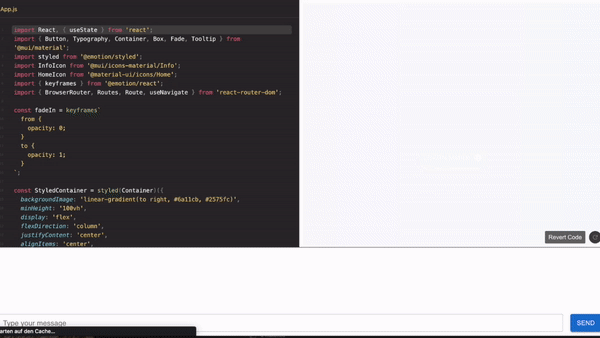
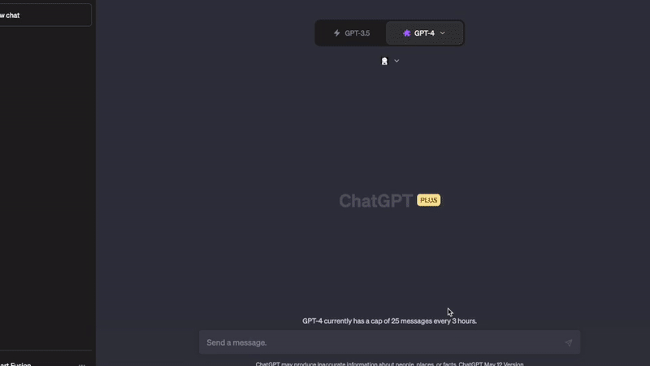

# React Live Code Editor with ChatGPT Integration

This project is a React-based live code editor integrated with OpenAI's ChatGPT API. It provides an interactive and intuitive interface where users can edit and run their code while also getting suggestions and help from ChatGPT. Users can apply the code generated by ChatGPT with a single click, making it a powerful tool for developers to explore and experiment with their ideas.

## Live Demo

[For Developers - https://reactor-dev.vercel.app](https://reactor-dev.vercel.app)

[Reactor_for_Developers_v1](https://github.com/admineral/Reactor/tree/main/Reactor_for_Developers/Reactor_dev_v1)

## Features

- Live code editing using Ace Editor
- React-Live for real-time rendering of React components
- OpenAI's ChatGPT API integration for code suggestions
- Interactive chat interface for seamless communication with ChatGPT

## 🚀 Reactor Plugin for ChatGPT 🚀
https://github.com/admineral/Reactor-ChatGPT-Plugin

# Contributing

Contributions are always welcome! Feel free to submit a pull request, create an issue, or suggest new features.

# Planned Features for the Future:

- Vercel Ai SDK + OpenAI function call

- Perfect Prompt Generation

- GPT-Engineer implementation.

- NextJS App Router

