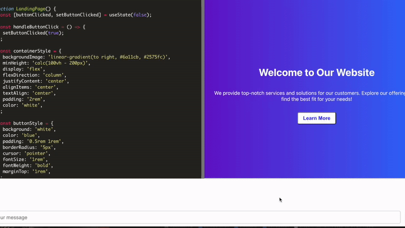

# React Live Code Editor with ChatGPT Integration

This project is a React-based live code editor integrated with OpenAI's ChatGPT API. It provides an interactive and intuitive interface where users can edit and run their code while also getting suggestions and help from ChatGPT. Users can apply the code generated by ChatGPT with a single click, making it a powerful tool for developers to explore and experiment with their ideas.


## Live Demo
v_2
The live demo of  the app is available at [https://reactor-git-new-design-admineral.vercel.app](https://reactor-phi.vercel.app).


v_1
[https://reactor-phi.vercel.app](https://reactor-phi.vercel.app).




## Features

- Live code editing using Ace Editor
- React-Live for real-time rendering of React components
- OpenAI's ChatGPT API integration for code suggestions
- Interactive chat interface for seamless communication with ChatGPT


## Deploying on Vercel

To deploy this app on Vercel, follow these steps:

1. Fork the repository from GitHub: [Reactor](https://github.com/admineral/Reactor.git)
2. Sign up for a [Vercel account](https://vercel.com/signup) if you don't have one
3. Connect your GitHub account with Vercel
4. Import the forked repository as a new project on Vercel
5. Add your `REACT_APP_API_KEY` as an environment variable in the Vercel project settings
6. Deploy your project


## Running the app locally

To run this app locally, follow these steps:

1. Clone the repository:

```
git clone https://github.com/admineral/Reactor.git
```

2. Navigate to the project directory:

```
cd Reactor
```

3. Install the dependencies:

```
npm install
```

4. Create a `.env` file in the root of the project directory and add your OpenAI API key:

```
REACT_APP_API_KEY=your-api-key
```

5. Start the development server:

```
npm start
```

The app should now be running at `http://localhost:3000`.


## Creating the React app from scratch

To create a similar React app from scratch, follow these steps:

1. Install the [Create React App](https://reactjs.org/docs/create-a-new-react-app.html) CLI tool:

```
npm install -g create-react-app
```

2. Create a new React app:

```
create-react-app reactor
```

3. Navigate to the project directory:

```
cd reactor
```


4. Install the necessary dependencies:

```
npm install react-ace ace-builds @mui/material react-live react-draggable
```

or:

6. Follow the instructions under "Running the app locally" to set up the environment variables and run the app


## Contributing
Thanks to https://github.com/asj9469
Contributions are always welcome! Feel free to submit a pull request, create an issue, or suggest new features.

